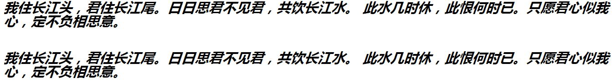

##用css控制字体
```
<style>
	div {
		font-style:italic;
		font-weight:bold;
		font-size:30px;
		line-height:30px;
		font-family:'微软雅黑';
	}
	p {
		font:italic bold 30px/30px '微软雅黑';
	}
</style>
<body>
<div>离离原上草，一岁一枯荣。

野火烧不尽，春风吹又生。

远芳侵古道，晴翠接荒城。

又送王孙去，萋萋满别情。</div>
<br />
<p> 离离原上草，一岁一枯荣。

野火烧不尽，春风吹又生。

远芳侵古道，晴翠接荒城。

又送王孙去，萋萋满别情。
</p>
</body>
```
照着以上格式来便是，值得注意的是在简写的时候30px/30px是为了区分font-size和line-height。
以下是运行截图:
<<<<<<< HEAD

=======

>>>>>>> parent of 029b3f5... Revert "修改无聊的代码"
